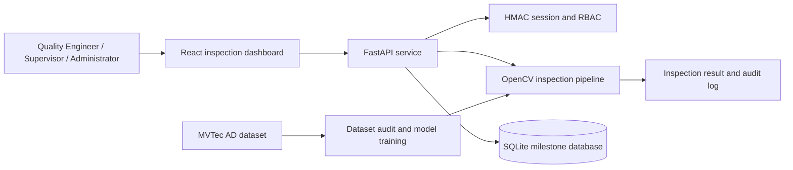

# VisionInspect AI Architecture

## Milestone status

The project is complete across all four milestones. Each phase is implemented in code, connected through the same FastAPI and React stack, and validated with repository-level smoke tests.

### Milestone 1 — Inspection workflow foundation

Milestone 1 establishes the local inspection workflow, role-based access, dataset integration, and persistent inspection records.

### Milestone 2 — Data and model intelligence

Milestone 2 adds the dataset audit and model training pipeline. The backend includes the MVTec AD loader, dataset audit report, feature extraction logic, and reproducible training/evaluation scripts used to produce the defect model.

### Milestone 3 — Analytics and operational visibility

Milestone 3 turns inspection results into operator-facing intelligence. It includes inspection history, quality analytics, audit events, model metadata, and user administration in the API and dashboard.

### Milestone 4 — Deployment readiness

Milestone 4 packages the system for running in a development or production-like environment. The repo includes Docker build definitions, environment configuration, and a containerized frontend/backend deployment model.

## Request Workflow

1. A user signs in through `POST /api/auth/login`.
2. The API validates the session and role permission.
3. The dashboard uploads an image with source, operator, and batch metadata.
4. The inspection pipeline validates and decodes the image, detects anomalies, classifies the result, calculates severity, and returns an annotated image.
5. The result and an audit event are stored in the database.
6. Authorized users view inspection history and analytics.

## Milestone Database Schema

- `users`: account identity, role, password hash, active state, and creation time.
- `inspections`: inspection identifier, timestamp, and serialized inspection result.
- `audit_log`: actor, action, timestamp, and structured metadata.

The schema is stored in [backend/schema.sql](../backend/schema.sql) and applied automatically when the API opens the database. SQLite keeps the milestone self-contained; the API boundary allows a production database to replace it later.

## Roles

- **Quality Engineer**: inspect images and view analytics.
- **Factory Supervisor**: inspect images, view analytics, and view audit events.
- **Administrator**: all supervisor permissions plus user management.

## Dataset Workflow

The MVTec AD directory is discovered relative to the backend source, so dataset audit and training work from either the repository root or `backend/`. The dataset itself remains local and ignored by Git because of its size and license requirements.

The active inspection and classifier are bottle-only: the bottle reference images and bottle-trained model are used for every inspection, and the evaluator is restricted to bottle samples. Other category folders are retained for local dataset auditing but are not used for predictions.

## Verification

The repository is validated with the project smoke checks:

- `python -m unittest backend/test_requirements.py`
- API health and login checks against the running FastAPI service
- Docker compose startup validation for the frontend/backend deployment model

These checks confirm the four milestones are operationally complete from the current codebase.
