# VisionInspect AI — System Architecture & UML Documentation
## Comprehensive Multi-Milestone Architectural Specification (Milestones 1 – 3)

---

**Project Title:** VisionInspect AI — Manufacturing Defect Detection, Object Detection & Quality Inspection System  
**Author:** Vinay Kumar Mandalapu  
**Scope:** Milestones 1, 2, and 3 Architectural Specification & System Design  
**Date:** September 2026  
**Version:** 3.0  
**Repository:** `vinay98485/VisionInspect-AI`  

---

## Executive Summary & Document Structure

VisionInspect AI is an industrial-grade automated visual inspection platform engineered for high-throughput manufacturing lines. The platform combines deep learning classification, unsupervised patch-based anomaly detection, semantic segmentation, bounding-box object detection, multi-factor defect severity scoring, advisory rework guidance, supervisory quality governance, and manufacturing analytics.

This document serves as the **unified architectural source of truth** across the first three project milestones, providing both visual UML diagram representations and formal Mermaid state/flow specifications:

- **[Part 1: Milestone 1 — Core Platform Foundation, RBAC & Review Queue](#part-1-milestone-1-uml-architecture--platform-foundation)** (9 UML Diagrams)
- **[Part 2: Milestone 2 — AI Inspection Engine, Anomaly Detection & Dual Localization](#part-2-milestone-2-uml-architecture--ai-inspection--dual-localization)** (4 UML Diagrams)
- **[Part 3: Milestone 3 — Supervisory Quality Governance, Automated Severity & Manufacturing Analytics](#part-3-milestone-3-uml-architecture--manufacturing-analytics--supervisory-governance)** (4 UML Diagrams)
- **[Part 4: Cross-Milestone Traceability & Implementation Matrix](#part-4-cross-milestone-traceability--implementation-matrix)** (Traceability mapping diagrams to source code)

---

# Part 1: Milestone 1 UML Architecture — Platform Foundation

Milestone 1 establishes the production infrastructure: a decoupled client-server architecture featuring a FastAPI backend, PostgreSQL persistence with 28 inspection fields, a React 19 frontend with Tailwind CSS, JWT authentication with Argon2 password hashing, role-based access control (RBAC), secure multipart image ingestion, and a supervisory review queue.

---

### 1.1 Use Case Diagram (Milestone 1)

The Use Case Diagram defines the operational responsibilities separated between **Quality Engineers** (Role ID 1) and **Factory Supervisors** (Role ID 2).

  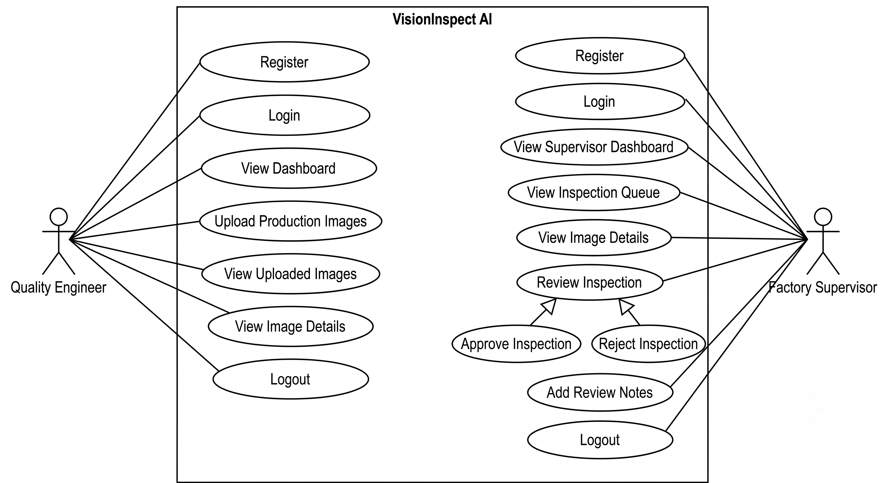

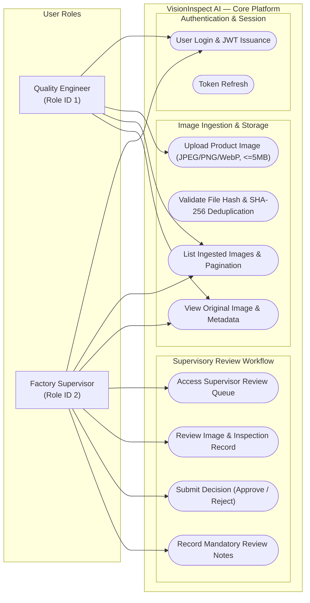
```mermaid
flowchart LR
    subgraph Actors ["User Roles"]
        QE["Quality Engineer<br/>(Role ID 1)"]
        FS["Factory Supervisor<br/>(Role ID 2)"]
    end

    subgraph System ["VisionInspect AI — Core Platform"]
        subgraph AuthBoundary ["Authentication & Session"]
            UC_Auth(["User Login & JWT Issuance"])
            UC_Refresh(["Token Refresh"])
        end

        subgraph IngestionBoundary ["Image Ingestion & Storage"]
            UC_Upload(["Upload Product Image (JPEG/PNG/WebP, <=5MB)"])
            UC_Validate(["Validate File Hash & SHA-256 Deduplication"])
            UC_List(["List Ingested Images & Pagination"])
            UC_ViewRaw(["View Original Image & Metadata"])
        end

        subgraph ReviewBoundary ["Supervisory Review Workflow"]
            UC_Queue(["Access Supervisor Review Queue"])
            UC_Audit(["Review Image & Inspection Record"])
            UC_SignOff(["Submit Decision (Approve / Reject)"])
            UC_Notes(["Record Mandatory Review Notes"])
        end
    end

    QE --> UC_Auth
    QE --> UC_Upload
    QE --> UC_List
    QE --> UC_ViewRaw

    FS --> UC_Auth
    FS --> UC_List
    FS --> UC_ViewRaw
    FS --> UC_Queue
    FS --> UC_Audit
    FS --> UC_SignOff
    FS --> UC_Notes
```

#### Non-Technical Explanation
- **Quality Engineer (Line Operator)**: Responsible for logging into the workstation, uploading newly captured specimen photographs from the assembly line, checking that the upload succeeded, and viewing image metadata.
- **Factory Supervisor (Quality Auditor)**: Has full visibility over all uploaded imagery plus exclusive access to the supervisory review queue. The supervisor examines records, makes official quality judgements (Approve or Reject), and enters mandatory comments explaining why the decision was made.

#### Technical Specifications
- **RBAC Enforcement**: Implemented in `backend/app/core/security.py` via FastAPI dependencies `require_role(1)` and `require_role(2)`.
- **Upload Validation**: Enforces MIME validation (`image/jpeg`, `image/png`, `image/webp`), 5 MB payload limit, and SHA-256 fingerprint deduplication.

---

### 1.2 Activity Diagram (Milestone 1)

The Activity Diagram models the step-by-step workflow of image ingestion, backend validation, storage, and supervisory audit sign-off.

  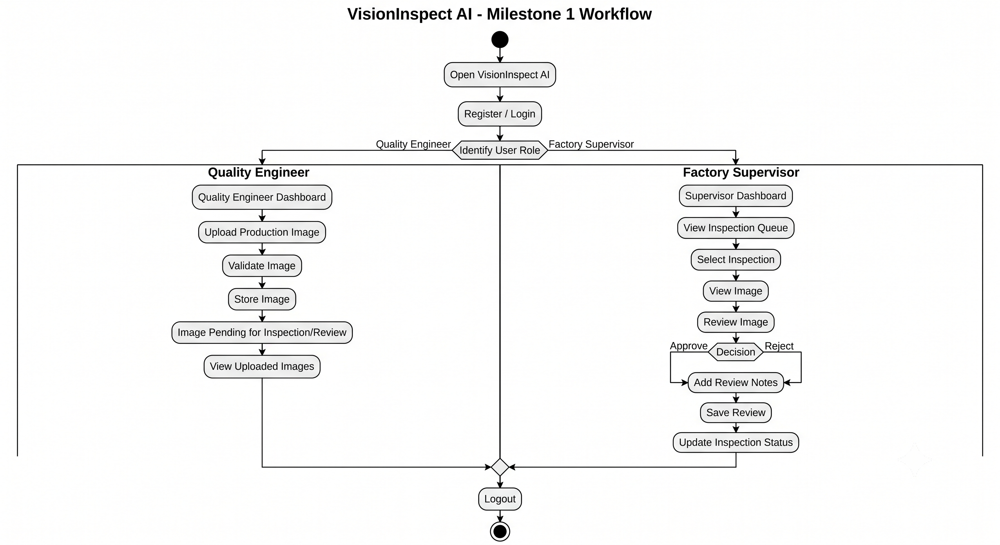

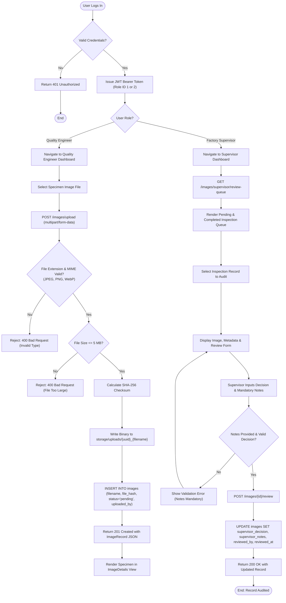
```mermaid
flowchart TD
    Start([User Logs In]) --> AuthCheck{"Valid Credentials?"}
    AuthCheck -->|No| AuthFail["Return 401 Unauthorized"]
    AuthFail --> EndAuth([End])
    
    AuthCheck -->|Yes| IssueToken["Issue JWT Bearer Token (Role ID 1 or 2)"]
    IssueToken --> RoleSwitch{"User Role?"}

    %% Quality Engineer Flow
    RoleSwitch -->|Quality Engineer| QEDash["Navigate to Quality Engineer Dashboard"]
    QEDash --> SelectFile["Select Specimen Image File"]
    SelectFile --> UploadPost["POST /images/upload (multipart/form-data)"]
    
    UploadPost --> ValidateExt{"File Extension & MIME Valid?<br/>(JPEG, PNG, WebP)"}
    ValidateExt -->|No| Err400["Reject: 400 Bad Request (Invalid Type)"]
    ValidateExt -->|Yes| ValidateSize{"File Size <= 5 MB?"}
    ValidateSize -->|No| ErrSize["Reject: 400 Bad Request (File Too Large)"]
    ValidateSize -->|Yes| HashCalc["Calculate SHA-256 Checksum"]
    
    HashCalc --> WriteDisk["Write Binary to storage/uploads/{uuid}_{filename}"]
    WriteDisk --> InsertDB["INSERT INTO images (filename, file_hash, status='pending', uploaded_by)"]
    InsertDB --> UploadSuccess["Return 201 Created with ImageRecord JSON"]
    UploadSuccess --> QEView["Render Specimen in ImageDetails View"]

    %% Supervisor Flow
    RoleSwitch -->|Factory Supervisor| SupDash["Navigate to Supervisor Dashboard"]
    SupDash --> FetchQueue["GET /images/supervisor/review-queue"]
    FetchQueue --> RenderQueue["Render Pending & Completed Inspection Queue"]
    RenderQueue --> SelectRecord["Select Inspection Record to Audit"]
    SelectRecord --> DisplayRecord["Display Image, Metadata & Review Form"]
    
    DisplayRecord --> SubmitReview["Supervisor Inputs Decision & Mandatory Notes"]
    SubmitReview --> ValidateNotes{"Notes Provided & Valid Decision?"}
    ValidateNotes -->|No| NotesRequired["Show Validation Error (Notes Mandatory)"]
    NotesRequired --> DisplayRecord
    ValidateNotes -->|Yes| PostReview["POST /images/{id}/review"]
    PostReview --> UpdateReviewDB["UPDATE images SET supervisor_decision, supervisor_notes, reviewed_by, reviewed_at"]
    UpdateReviewDB --> ReviewConfirm["Return 200 OK with Updated Record"]
    ReviewConfirm --> EndSuccess([End: Record Audited])
```

#### Non-Technical Explanation
1. An operator or supervisor signs in with their company credentials and receives a secure session token.
2. If an operator uploads a photo, the system checks whether the file is an acceptable image format and under 5 MB. If valid, the file is saved onto secure storage and cataloged in the database.
3. If a supervisor logs in, they see a dedicated queue of inspection records. The supervisor selects any pending record, evaluates it, writes detailed comments, and signs off.

---

### 1.3 Sequence Diagram — Image Ingestion & Upload (Milestone 1)

This sequence diagram depicts the detailed chronological interaction between the Quality Engineer, React client, FastAPI service, PostgreSQL, and the physical filesystem during upload.

  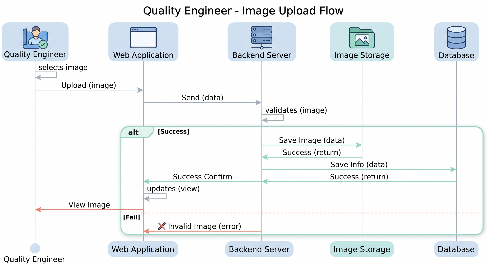

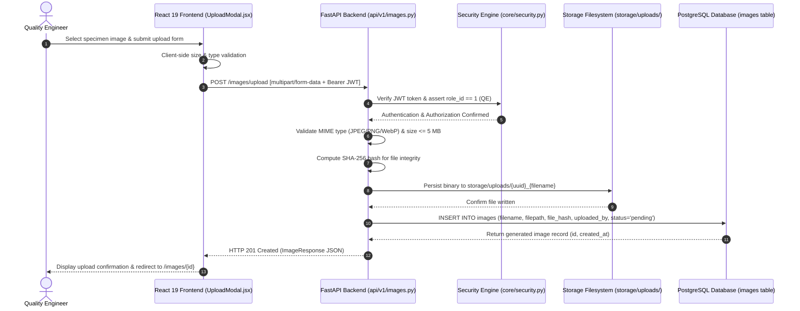
```mermaid
sequenceDiagram
    autonumber
    actor QE as Quality Engineer
    participant UI as React 19 Frontend (UploadModal.jsx)
    participant API as FastAPI Backend (api/v1/images.py)
    participant Sec as Security Engine (core/security.py)
    participant Disk as Storage Filesystem (storage/uploads/)
    participant DB as PostgreSQL Database (images table)

    QE->>UI: Select specimen image & submit upload form
    UI->>UI: Client-side size & type validation
    UI->>API: POST /images/upload [multipart/form-data + Bearer JWT]
    
    API->>Sec: Verify JWT token & assert role_id == 1 (QE)
    Sec-->>API: Authentication & Authorization Confirmed
    
    API->>API: Validate MIME type (JPEG/PNG/WebP) & size <= 5 MB
    API->>API: Compute SHA-256 hash for file integrity
    API->>Disk: Persist binary to storage/uploads/{uuid}_{filename}
    Disk-->>API: Confirm file written
    
    API->>DB: INSERT INTO images (filename, filepath, file_hash, uploaded_by, status='pending')
    DB-->>API: Return generated image record (id, created_at)
    
    API-->>UI: HTTP 201 Created (ImageResponse JSON)
    UI-->>QE: Display upload confirmation & redirect to /images/{id}
```

#### Technical Walkthrough
1. The frontend (`UploadModal.jsx`) creates a `FormData` object containing the binary file and dispatches it with the Authorization header.
2. The FastAPI route handler `upload_image()` validates the file's binary signature and length.
3. A unique UUID prefix is appended to prevent filename collision, and SHA-256 hashing is executed.
4. An `ImageRecord` row is inserted using SQLAlchemy with `status = "pending"`, and the record is returned to the user interface.

---

### 1.4 Sequence Diagram — Supervisor Audit & Review (Milestone 1)

This sequence diagram depicts the supervisory sign-off workflow where a supervisor audits an inspection and records a binding governance decision.

  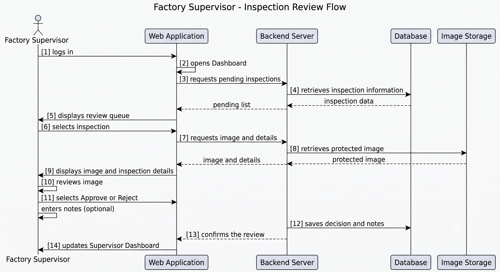

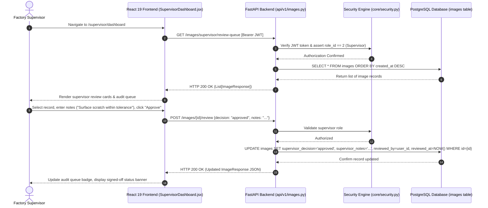
```mermaid
sequenceDiagram
    autonumber
    actor FS as Factory Supervisor
    participant UI as React 19 Frontend (SupervisorDashboard.jsx)
    participant API as FastAPI Backend (api/v1/images.py)
    participant Sec as Security Engine (core/security.py)
    participant DB as PostgreSQL Database (images table)

    FS->>UI: Navigate to /supervisor/dashboard
    UI->>API: GET /images/supervisor/review-queue [Bearer JWT]
    API->>Sec: Verify JWT token & assert role_id == 2 (Supervisor)
    Sec-->>API: Authorization Confirmed
    
    API->>DB: SELECT * FROM images ORDER BY created_at DESC
    DB-->>API: Return list of image records
    API-->>UI: HTTP 200 OK (List[ImageResponse])
    UI-->>FS: Render supervisor review cards & audit queue
    
    FS->>UI: Select record, enter notes ("Surface scratch within tolerance"), click "Approve"
    UI->>API: POST /images/{id}/review {decision: "approved", notes: "..."}
    API->>Sec: Validate supervisor role
    Sec-->>API: Authorized
    
    API->>DB: UPDATE images SET supervisor_decision='approved', supervisor_notes='...', reviewed_by=user_id, reviewed_at=NOW() WHERE id={id}
    DB-->>API: Confirm record updated
    
    API-->>UI: HTTP 200 OK (Updated ImageResponse JSON)
    UI-->>FS: Update audit queue badge, display signed-off status banner
```

---

### 1.5 Class Diagram (Milestone 1)

The Class Diagram illustrates the object-oriented structure of data models, schemas, and service layers governing Milestone 1.

  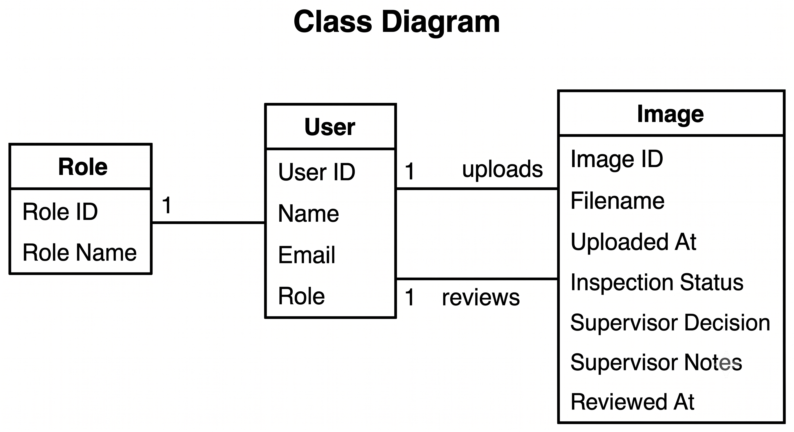

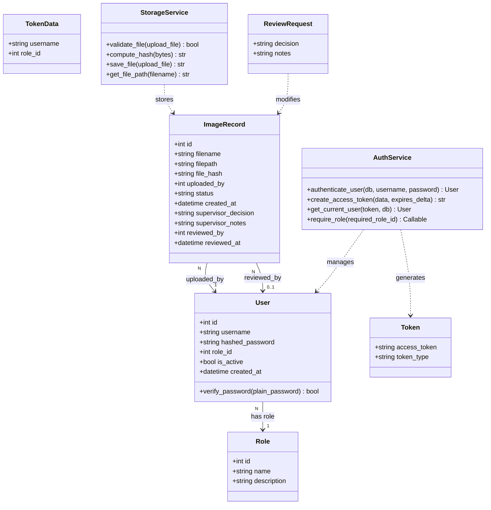
```mermaid
classDiagram
    class User {
        +int id
        +string username
        +string hashed_password
        +int role_id
        +bool is_active
        +datetime created_at
        +verify_password(plain_password) bool
    }

    class Role {
        +int id
        +string name
        +string description
    }

    class ImageRecord {
        +int id
        +string filename
        +string filepath
        +string file_hash
        +int uploaded_by
        +string status
        +datetime created_at
        +string supervisor_decision
        +string supervisor_notes
        +int reviewed_by
        +datetime reviewed_at
    }

    class Token {
        +string access_token
        +string token_type
    }

    class TokenData {
        +string username
        +int role_id
    }

    class ReviewRequest {
        +string decision
        +string notes
    }

    class AuthService {
        +authenticate_user(db, username, password) User
        +create_access_token(data, expires_delta) str
        +get_current_user(token, db) User
        +require_role(required_role_id) Callable
    }

    class StorageService {
        +validate_file(upload_file) bool
        +compute_hash(bytes) str
        +save_file(upload_file) str
        +get_file_path(filename) str
    }

    User "N" --> "1" Role : has role
    ImageRecord "N" --> "1" User : uploaded_by
    ImageRecord "N" --> "0..1" User : reviewed_by
    AuthService ..> User : manages
    AuthService ..> Token : generates
    StorageService ..> ImageRecord : stores
    ReviewRequest ..> ImageRecord : modifies
```

---

### 1.6 Database Entity-Relationship Diagram (Milestone 1)

The Entity-Relationship Diagram (ERD) specifies relational schemas, primary and foreign key constraints, and field datatypes.

  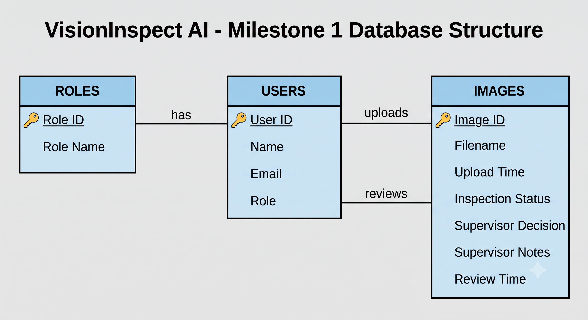

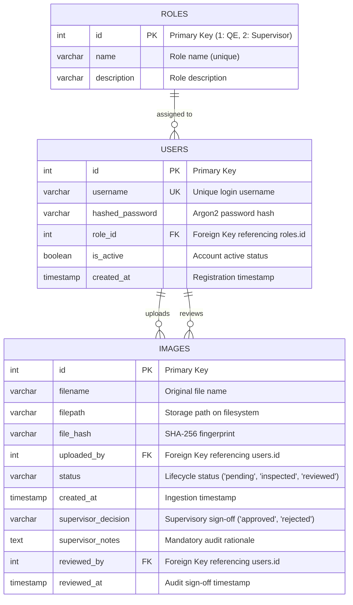
```mermaid
erDiagram
    ROLES ||--o{ USERS : "assigned to"
    USERS ||--o{ IMAGES : "uploads"
    USERS ||--o{ IMAGES : "reviews"

    ROLES {
        int id PK "Primary Key (1: QE, 2: Supervisor)"
        varchar name "Role name (unique)"
        varchar description "Role description"
    }

    USERS {
        int id PK "Primary Key"
        varchar username UK "Unique login username"
        varchar hashed_password "Argon2 password hash"
        int role_id FK "Foreign Key referencing roles.id"
        boolean is_active "Account active status"
        timestamp created_at "Registration timestamp"
    }

    IMAGES {
        int id PK "Primary Key"
        varchar filename "Original file name"
        varchar filepath "Storage path on filesystem"
        varchar file_hash "SHA-256 fingerprint"
        int uploaded_by FK "Foreign Key referencing users.id"
        varchar status "Lifecycle status ('pending', 'inspected', 'reviewed')"
        timestamp created_at "Ingestion timestamp"
        varchar supervisor_decision "Supervisory sign-off ('approved', 'rejected')"
        text supervisor_notes "Mandatory audit rationale"
        int reviewed_by FK "Foreign Key referencing users.id"
        timestamp reviewed_at "Audit sign-off timestamp"
    }
```

---

### 1.7 State Machine Diagram — Inspection Record Lifecycle (Milestone 1)

The State Machine Diagram tracks all permissible state transitions for a physical specimen record as it advances through the platform.

  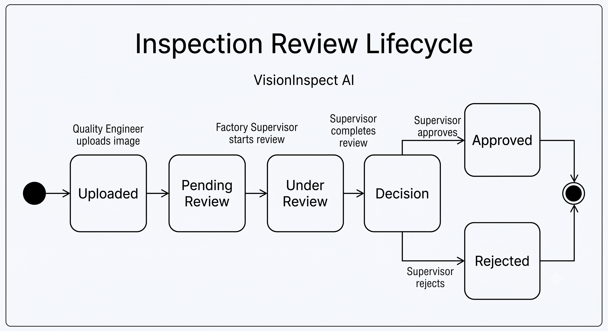

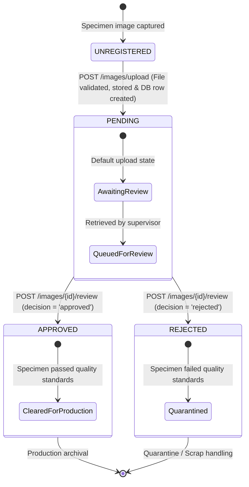
```mermaid
stateDiagram-v2
    [*] --> UNREGISTERED : Specimen image captured

    UNREGISTERED --> PENDING : POST /images/upload (File validated, stored & DB row created)
    
    state PENDING {
        [*] --> AwaitingReview : Default upload state
        AwaitingReview --> QueuedForReview : Retrieved by supervisor
    }

    PENDING --> APPROVED : POST /images/{id}/review (decision = 'approved')
    PENDING --> REJECTED : POST /images/{id}/review (decision = 'rejected')

    state APPROVED {
        [*] --> ClearedForProduction : Specimen passed quality standards
    }

    state REJECTED {
        [*] --> Quarantined : Specimen failed quality standards
    }

    APPROVED --> [*] : Production archival
    REJECTED --> [*] : Quarantine / Scrap handling
```

---

### 1.8 System Architecture Diagram (Milestone 1)

The High-Level Architecture Diagram for Milestone 1 illustrates the 3-tier architecture: presentation, API/service, and persistence.

  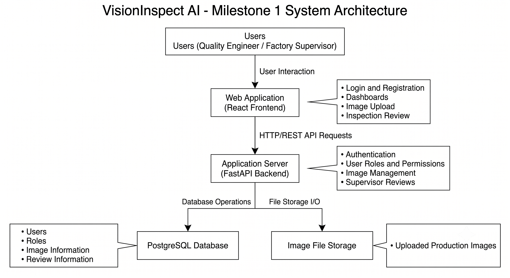

```mermaid
flowchart TD
    subgraph ClientTier ["Presentation Layer (Client Browser)"]
        direction TB
        ReactApp["React 19 Single Page Application (Vite)<br/>• Quality Engineer Upload Portal<br/>• Specimen Details Viewer<br/>• Supervisor Review Dashboard<br/>• Role-Based Guarded Routing"]
    end

    subgraph ServiceTier ["Application & API Layer (FastAPI)"]
        direction TB
        APIGateway["FastAPI Web Framework (Uvicorn)<br/>• CORS Middleware<br/>• Request Size Limiter"]
        AuthModule["Authentication Engine<br/>• OAuth2 Password Bearer<br/>• Argon2 Hashing<br/>• JWT Token Generator"]
        ImageModule["Image Management Router<br/>• Multipart Form Parser<br/>• File Validator & SHA-256 Hashing<br/>• Review Queue Controller"]
    end

    subgraph DataTier ["Persistence & Storage Layer"]
        direction TB
        DB[("PostgreSQL Database<br/>• users table<br/>• roles table<br/>• images table")]
        DiskStore[("Physical Disk Storage<br/>• storage/uploads/")]
    end

    ReactApp -->|HTTP / JSON (REST)| APIGateway
    APIGateway --> AuthModule
    APIGateway --> ImageModule
    AuthModule --> DB
    ImageModule --> DB
    ImageModule --> DiskStore
```

---

### 1.9 Deployment Diagram (Milestone 1)

The Deployment Diagram details how physical hardware nodes, network protocols, server runtimes, and local volumes interact.

  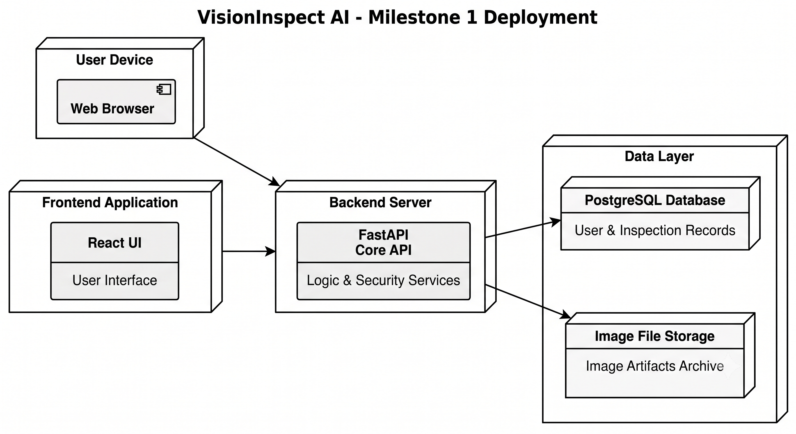

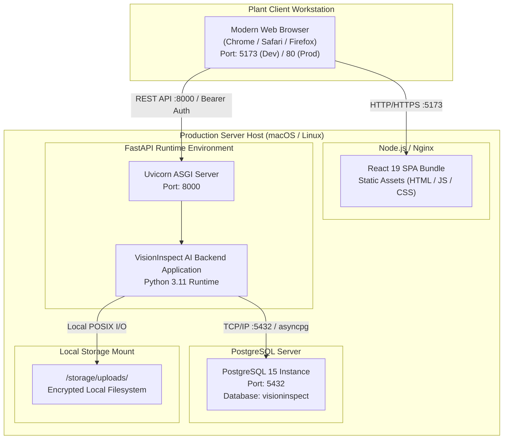
```mermaid
flowchart TD
    subgraph Workstation ["Plant Client Workstation"]
        Browser["Modern Web Browser<br/>(Chrome / Safari / Firefox)<br/>Port: 5173 (Dev) / 80 (Prod)"]
    end

    subgraph AppHost ["Production Server Host (macOS / Linux)"]
        subgraph FrontendServer ["Node.js / Nginx"]
            Vite["React 19 SPA Bundle<br/>Static Assets (HTML / JS / CSS)"]
        end

        subgraph BackendServer ["FastAPI Runtime Environment"]
            Uvicorn["Uvicorn ASGI Server<br/>Port: 8000"]
            FastAPI["VisionInspect AI Backend Application<br/>Python 3.11 Runtime"]
        end

        subgraph DatabaseServer ["PostgreSQL Server"]
            Postgres["PostgreSQL 15 Instance<br/>Port: 5432<br/>Database: visioninspect"]
        end

        subgraph StorageVolume ["Local Storage Mount"]
            UploadsDir["/storage/uploads/<br/>Encrypted Local Filesystem"]
        end
    end

    Browser -->|HTTP/HTTPS :5173| Vite
    Browser -->|REST API :8000 / Bearer Auth| Uvicorn
    Uvicorn --> FastAPI
    FastAPI -->|TCP/IP :5432 / asyncpg| Postgres
    FastAPI -->|Local POSIX I/O| UploadsDir
```

---

# Part 2: Milestone 2 UML Architecture — AI Inspection & Dual Localization

Milestone 2 augments the foundational platform with a multi-model deep learning inspection engine. It incorporates category classification (15 classes, 100% accuracy), patch-based anomaly detection (ResNet18 Layer 3), hierarchical defect classification, a 4-quadrant Decision Fusion arbiter, U-Net semantic segmentation, YOLO11n bounding-box object detection, and composite overlay rendering.

---

### 2.1 Use Case Diagram (Milestone 2)

The Milestone 2 Use Case Diagram illustrates the addition of deep learning inference capabilities to the operator and supervisor roles.

  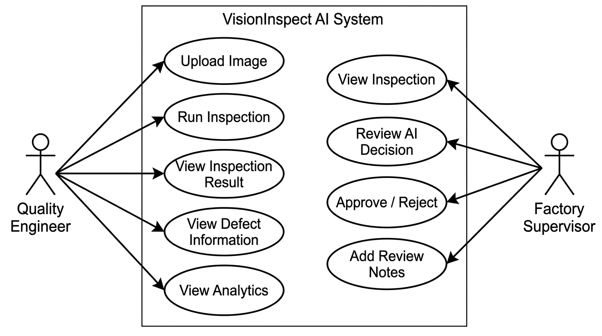

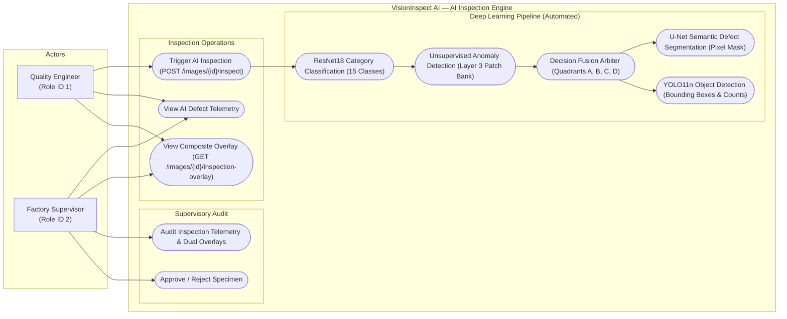
```mermaid
flowchart LR
    subgraph Actors ["Actors"]
        QE["Quality Engineer<br/>(Role ID 1)"]
        FS["Factory Supervisor<br/>(Role ID 2)"]
    end

    subgraph Platform ["VisionInspect AI — AI Inspection Engine"]
        subgraph CoreOps ["Inspection Operations"]
            UC_Trigger(["Trigger AI Inspection (POST /images/{id}/inspect)"])
            UC_Telemetry(["View AI Defect Telemetry"])
            UC_Overlay(["View Composite Overlay (GET /images/{id}/inspection-overlay)"])
        end

        subgraph Models ["Deep Learning Pipeline (Automated)"]
            UC_CatClass(["ResNet18 Category Classification (15 Classes)"])
            UC_AnomDet(["Unsupervised Anomaly Detection (Layer 3 Patch Bank)"])
            UC_Fusion(["Decision Fusion Arbiter (Quadrants A, B, C, D)"])
            UC_UNet(["U-Net Semantic Defect Segmentation (Pixel Mask)"])
            UC_YOLO(["YOLO11n Object Detection (Bounding Boxes & Counts)"])
        end

        subgraph AuditOps ["Supervisory Audit"]
            UC_Review(["Audit Inspection Telemetry & Dual Overlays"])
            UC_SignOff(["Approve / Reject Specimen"])
        end
    end

    QE --> UC_Trigger
    QE --> UC_Telemetry
    QE --> UC_Overlay

    UC_Trigger --> UC_CatClass
    UC_CatClass --> UC_AnomDet
    UC_AnomDet --> UC_Fusion
    UC_Fusion --> UC_UNet
    UC_Fusion --> UC_YOLO

    FS --> UC_Telemetry
    FS --> UC_Overlay
    FS --> UC_Review
    FS --> UC_SignOff
```

#### Non-Technical Explanation
- **Automatic Multi-Stage Inspection**: When a Quality Engineer clicks "Run Inspection", the AI automatically identifies the object type (bottle, cable, capsule, etc.), scans for abnormal surface patterns, decides whether the part is nominal or defective, and pinpoints exactly where defects exist using both detailed outline contours (U-Net) and green bounding boxes (YOLO).
- **Dual Visual Overlay**: Operators and supervisors no longer look only at numbers; they see a side-by-side composite photograph where every scratch, dent, or contamination mark is outlined in red and framed in green boxes.

---

### 2.2 Activity Diagram — Dual Localization & Decision Fusion (Milestone 2)

The Milestone 2 Activity Diagram models the complete inference graph, emphasizing how the Gated Decision Fusion architecture executes heavy localization models only when a genuine defect is present.

  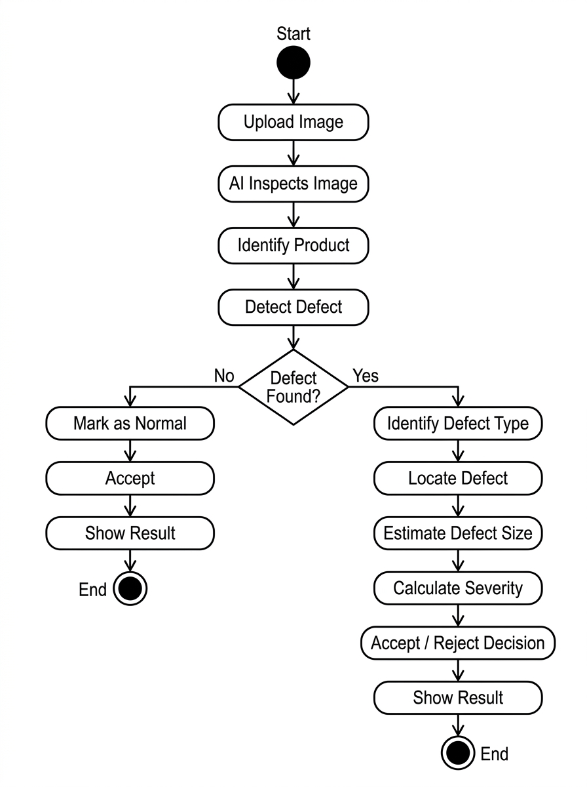

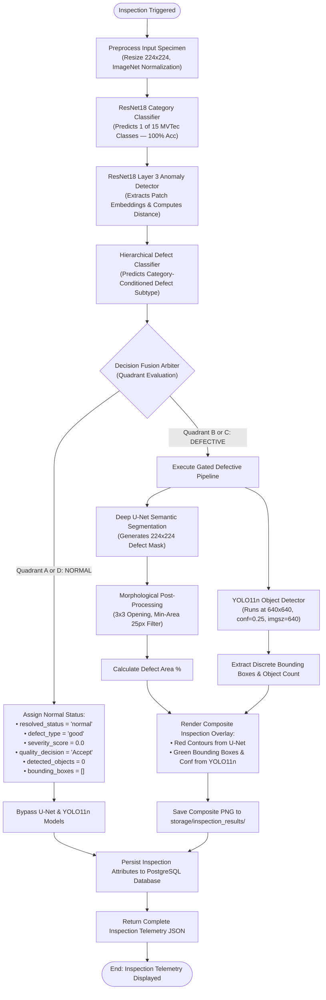
```mermaid
flowchart TD
    Start([Inspection Triggered]) --> Preprocess["Preprocess Input Specimen<br/>(Resize 224x224, ImageNet Normalization)"]
    Preprocess --> CatClass["ResNet18 Category Classifier<br/>(Predicts 1 of 15 MVTec Classes — 100% Acc)"]
    CatClass --> AnomalyDet["ResNet18 Layer 3 Anomaly Detector<br/>(Extracts Patch Embeddings & Computes Distance)"]
    AnomalyDet --> DefectClass["Hierarchical Defect Classifier<br/>(Predicts Category-Conditioned Defect Subtype)"]
    
    DefectClass --> Fusion{"Decision Fusion Arbiter<br/>(Quadrant Evaluation)"}

    %% Normal Path
    Fusion -->|Quadrant A or D: NORMAL| NormalPath["Assign Normal Status:<br/>• resolved_status = 'normal'<br/>• defect_type = 'good'<br/>• severity_score = 0.0<br/>• quality_decision = 'Accept'<br/>• detected_objects = 0<br/>• bounding_boxes = []"]
    NormalPath --> BypassModels["Bypass U-Net & YOLO11n Models"]
    BypassModels --> PersistDB

    %% Defective Path
    Fusion -->|Quadrant B or C: DEFECTIVE| DefectPath["Execute Gated Defective Pipeline"]
    
    DefectPath --> UNet["Deep U-Net Semantic Segmentation<br/>(Generates 224x224 Defect Mask)"]
    UNet --> PostProc["Morphological Post-Processing<br/>(3x3 Opening, Min-Area 25px Filter)"]
    PostProc --> CalcArea["Calculate Defect Area %"]

    DefectPath --> YOLO["YOLO11n Object Detector<br/>(Runs at 640x640, conf=0.25, imgsz=640)"]
    YOLO --> ExtractBoxes["Extract Discrete Bounding Boxes & Object Count"]

    CalcArea & ExtractBoxes --> CompositeOverlay["Render Composite Inspection Overlay:<br/>• Red Contours from U-Net<br/>• Green Bounding Boxes & Conf from YOLO11n"]
    
    CompositeOverlay --> PersistDisk["Save Composite PNG to storage/inspection_results/"]
    PersistDisk --> PersistDB["Persist Inspection Attributes to PostgreSQL Database"]
    PersistDB --> ReturnResult["Return Complete Inspection Telemetry JSON"]
    ReturnResult --> End([End: Inspection Telemetry Displayed])
```

#### Technical Walkthrough
1. **Category Classification**: The image is fed to a fine-tuned ResNet18 model that outputs the predicted object class (bottle, wood, transistor, etc.).
2. **Anomaly Distance**: A ResNet18 Layer 3 feature extractor compares the specimen's local patch embeddings against a precomputed bank of nominal reference embeddings.
3. **Hierarchical Defect Classification**: 15 dedicated classifier heads predict the specific defect subtype.
4. **Decision Fusion**: A quadrant evaluation resolves disagreements. Quadrants A and D evaluate to **NORMAL**; Quadrants B and C evaluate to **DEFECTIVE**.
5. **Gating Optimization**: If the specimen is normal, U-Net and YOLO are bypassed, guaranteeing zero false-positive bounding boxes and zero latency overhead. If defective, U-Net generates pixel contours and YOLO11n extracts bounding boxes.

---

### 2.3 Sequence Diagram — AI Inference & Dual Overlay Generation (Milestone 2)

This sequence diagram illustrates the synchronous message flow across the backend components during model inference and composite rendering.

  

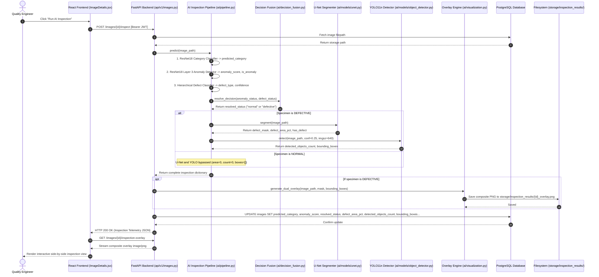
```mermaid
sequenceDiagram
    autonumber
    actor QE as Quality Engineer
    participant UI as React Frontend (ImageDetails.jsx)
    participant API as FastAPI Backend (api/v1/images.py)
    participant Pipe as AI Inspection Pipeline (ai/pipeline.py)
    participant Fusion as Decision Fusion (ai/decision_fusion.py)
    participant UNet as U-Net Segmenter (ai/models/unet.py)
    participant YOLO as YOLO11n Detector (ai/models/object_detector.py)
    participant Overlay as Overlay Engine (ai/visualization.py)
    participant DB as PostgreSQL Database
    participant Disk as Filesystem (storage/inspection_results/)

    QE->>UI: Click "Run AI Inspection"
    UI->>API: POST /images/{id}/inspect [Bearer JWT]
    API->>DB: Fetch image filepath
    DB-->>API: Return storage path
    
    API->>Pipe: predict(image_path)
    Pipe->>Pipe: 1. ResNet18 Category Classifier -> predicted_category
    Pipe->>Pipe: 2. ResNet18 Layer 3 Anomaly Detector -> anomaly_score, is_anomaly
    Pipe->>Pipe: 3. Hierarchical Defect Classifier -> defect_type, confidence
    
    Pipe->>Fusion: resolve_decision(anomaly_status, defect_status)
    Fusion-->>Pipe: Return resolved_status ("normal" or "defective")

    alt Specimen is DEFECTIVE
        Pipe->>UNet: segment(image_path)
        UNet-->>Pipe: Return defect_mask, defect_area_pct, has_defect
        
        Pipe->>YOLO: detect(image_path, conf=0.25, imgsz=640)
        YOLO-->>Pipe: Return detected_objects_count, bounding_boxes
    else Specimen is NORMAL
        Note over Pipe: U-Net and YOLO bypassed (area=0, count=0, boxes=[])
    end

    Pipe-->>API: Return complete inspection dictionary
    
    opt If specimen is DEFECTIVE
        API->>Overlay: generate_dual_overlay(image_path, mask, bounding_boxes)
        Overlay->>Disk: Save composite PNG to storage/inspection_results/{id}_overlay.png
        Disk-->>Overlay: Saved
    end

    API->>DB: UPDATE images SET predicted_category, anomaly_score, resolved_status, defect_area_pct, detected_objects_count, bounding_boxes...
    DB-->>API: Confirm update
    
    API-->>UI: HTTP 200 OK (Inspection Telemetry JSON)
    UI->>API: GET /images/{id}/inspection-overlay
    API-->>UI: Stream composite overlay image/png
    UI-->>QE: Render interactive side-by-side inspection view
```

---

### 2.4 System Architecture Diagram — Multi-Model AI Engine (Milestone 2)

This architectural diagram maps the layered components and data flows of the multi-model inspection system.

  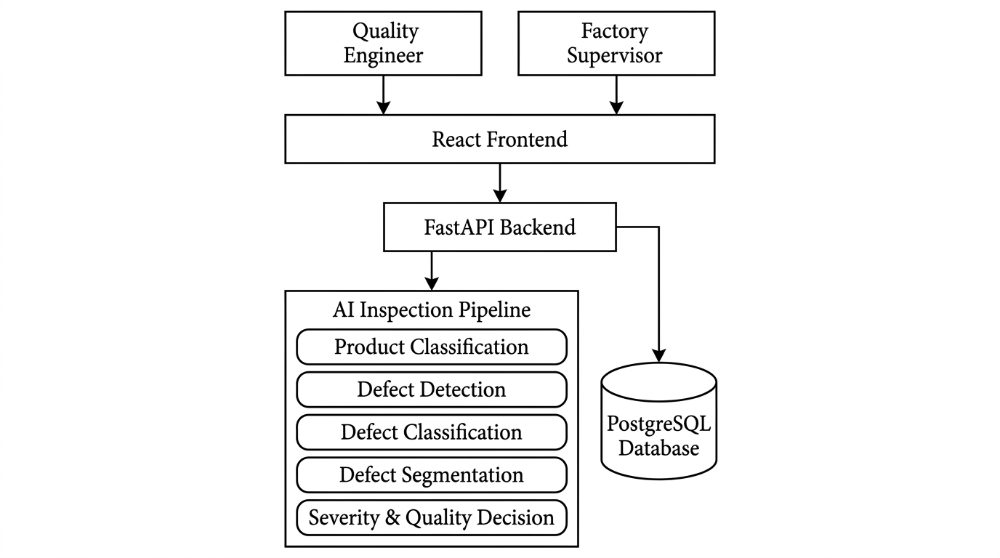

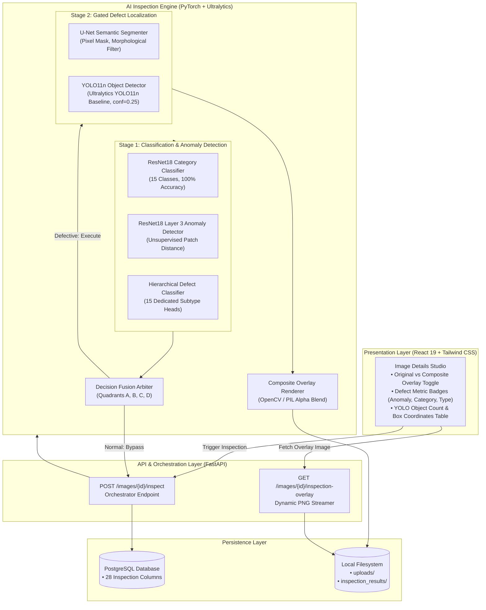
```mermaid
flowchart TD
    subgraph PresentationTier ["Presentation Layer (React 19 + Tailwind CSS)"]
        UI_View["Image Details Studio<br/>• Original vs Composite Overlay Toggle<br/>• Defect Metric Badges (Anomaly, Category, Type)<br/>• YOLO Object Count & Box Coordinates Table"]
    end

    subgraph APITier ["API & Orchestration Layer (FastAPI)"]
        InspectEndpoint["POST /images/{id}/inspect<br/>Orchestrator Endpoint"]
        OverlayEndpoint["GET /images/{id}/inspection-overlay<br/>Dynamic PNG Streamer"]
    end

    subgraph AIEngine ["AI Inspection Engine (PyTorch + Ultralytics)"]
        direction TB
        
        subgraph Stage1 ["Stage 1: Classification & Anomaly Detection"]
            CatM["ResNet18 Category Classifier<br/>(15 Classes, 100% Accuracy)"]
            AnomM["ResNet18 Layer 3 Anomaly Detector<br/>(Unsupervised Patch Distance)"]
            DefM["Hierarchical Defect Classifier<br/>(15 Dedicated Subtype Heads)"]
        end

        FusionEngine["Decision Fusion Arbiter<br/>(Quadrants A, B, C, D)"]

        subgraph Stage2 ["Stage 2: Gated Defect Localization"]
            UNetM["U-Net Semantic Segmenter<br/>(Pixel Mask, Morphological Filter)"]
            YOLOM["YOLO11n Object Detector<br/>(Ultralytics YOLO11n Baseline, conf=0.25)"]
        end

        OverlayGen["Composite Overlay Renderer<br/>(OpenCV / PIL Alpha Blend)"]
    end

    subgraph DataStorage ["Persistence Layer"]
        PostgresDB[("PostgreSQL Database<br/>• 28 Inspection Columns")]
        ImageStorage[("Local Filesystem<br/>• uploads/<br/>• inspection_results/")]
    end

    UI_View -->|Trigger Inspection| InspectEndpoint
    InspectEndpoint --> AIEngine
    AIEngine --> Stage1
    Stage1 --> FusionEngine
    FusionEngine -->|Normal: Bypass| InspectEndpoint
    FusionEngine -->|Defective: Execute| Stage2
    Stage2 --> OverlayGen
    OverlayGen --> ImageStorage
    InspectEndpoint --> PostgresDB
    UI_View -->|Fetch Overlay Image| OverlayEndpoint
    OverlayEndpoint --> ImageStorage
```

---

# Part 3: Milestone 3 UML Architecture — Manufacturing Analytics & Supervisory Governance

Milestone 3 elevates VisionInspect AI into an enterprise manufacturing quality platform. It introduces a multi-factor automated severity scoring engine (30% Size, 25% Location, 25% Defect Type, 20% Confidence), four automated advisory recommendations (PASS, CLEAN, REWORK, SCRAP), supervisor review queue governance with mandatory sign-off rationale, real-time KPI dashboards, multi-horizon trend analysis (7-day, 30-day, all-time), and official production quality report generation with CSV streaming export.

---

### 3.1 Use Case Diagram (Milestone 3)

The Milestone 3 Use Case Diagram highlights supervisory governance, operational metrics tracking, and compliance reporting.

  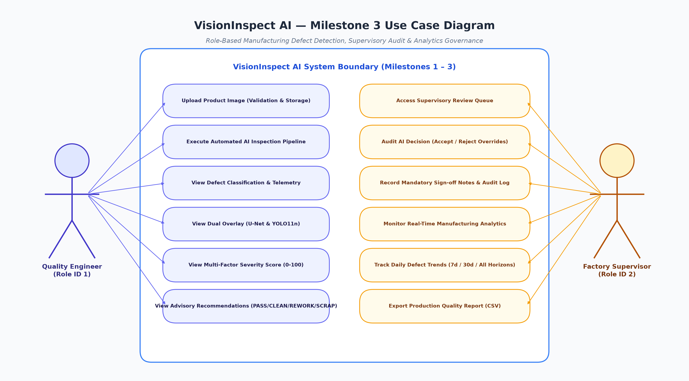

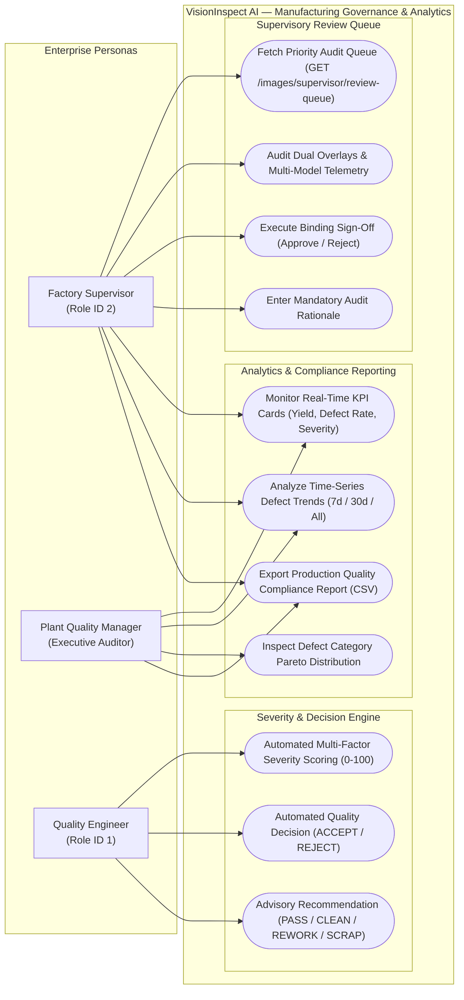
```mermaid
flowchart LR
    subgraph Actors ["Enterprise Personas"]
        FS["Factory Supervisor<br/>(Role ID 2)"]
        QM["Plant Quality Manager<br/>(Executive Auditor)"]
        QE["Quality Engineer<br/>(Role ID 1)"]
    end

    subgraph EnterprisePlatform ["VisionInspect AI — Manufacturing Governance & Analytics"]
        subgraph SeverityGovernance ["Severity & Decision Engine"]
            UC_SevCalc(["Automated Multi-Factor Severity Scoring (0-100)"])
            UC_Decision(["Automated Quality Decision (ACCEPT / REJECT)"])
            UC_Advisory(["Advisory Recommendation (PASS / CLEAN / REWORK / SCRAP)"])
        end

        subgraph ReviewWorkflow ["Supervisory Review Queue"]
            UC_FetchQueue(["Fetch Priority Audit Queue (GET /images/supervisor/review-queue)"])
            UC_AuditTelemetry(["Audit Dual Overlays & Multi-Model Telemetry"])
            UC_SignOff(["Execute Binding Sign-Off (Approve / Reject)"])
            UC_MandatoryNotes(["Enter Mandatory Audit Rationale"])
        end

        subgraph AnalyticsReporting ["Analytics & Compliance Reporting"]
            UC_RealtimeKPI(["Monitor Real-Time KPI Cards (Yield, Defect Rate, Severity)"])
            UC_TrendCharts(["Analyze Time-Series Defect Trends (7d / 30d / All)"])
            UC_Pareto(["Inspect Defect Category Pareto Distribution"])
            UC_ExportCSV(["Export Production Quality Compliance Report (CSV)"])
        end
    end

    QE --> UC_SevCalc
    QE --> UC_Decision
    QE --> UC_Advisory

    FS --> UC_FetchQueue
    FS --> UC_AuditTelemetry
    FS --> UC_SignOff
    FS --> UC_MandatoryNotes
    FS --> UC_RealtimeKPI
    FS --> UC_TrendCharts
    FS --> UC_ExportCSV

    QM --> UC_RealtimeKPI
    QM --> UC_TrendCharts
    QM --> UC_Pareto
    QM --> UC_ExportCSV
```

#### Non-Technical Explanation
- **Factory Supervisor**: Audits the completed AI inspections, verifies whether defects warrant stopping the line, enters legally binding notes, and issues final sign-off.
- **Plant Quality Manager**: Monitors factory health from an executive vantage point. Evaluates first-pass yield, defect occurrence rates across product lines, defect type Pareto breakdowns, and exports official production quality CSV reports for regulatory compliance.

---

### 3.2 Activity Diagram — Severity Scoring, Advisory & Governance (Milestone 3)

The Milestone 3 Activity Diagram models the exact mathematical formulation of the 4-factor severity calculation, advisory recommendation mapping, supervisory sign-off, and analytics refresh.

  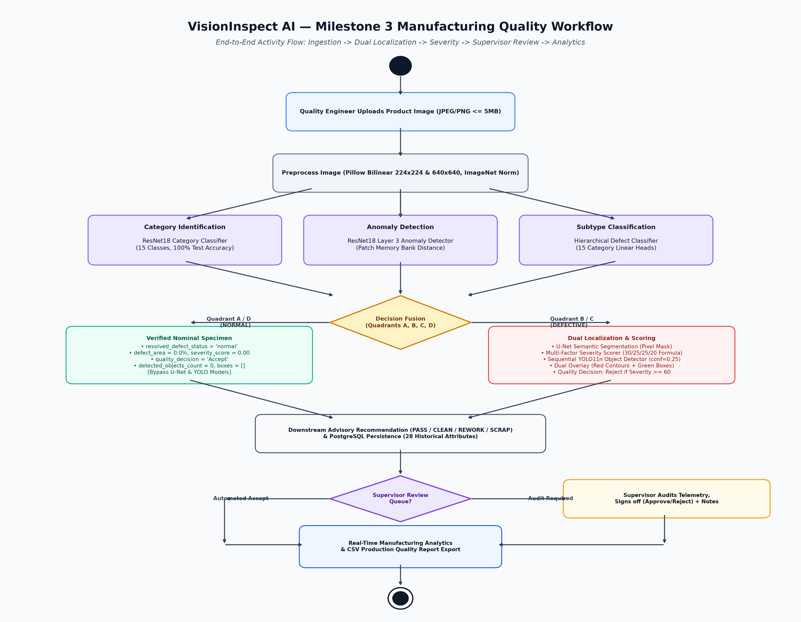

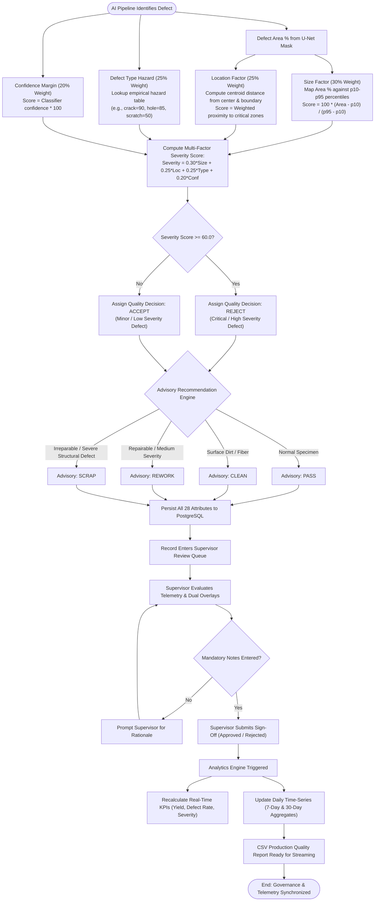
```mermaid
flowchart TD
    Start([AI Pipeline Identifies Defect]) --> Area["Defect Area % from U-Net Mask"]
    
    %% Multi-Factor Calculation
    Area --> Factor1["Size Factor (30% Weight)<br/>Map Area % against p10-p95 percentiles<br/>Score = 100 * (Area - p10) / (p95 - p10)"]
    Area --> Factor2["Location Factor (25% Weight)<br/>Compute centroid distance from center & boundary<br/>Score = Weighted proximity to critical zones"]
    Start --> Factor3["Defect Type Hazard (25% Weight)<br/>Lookup empirical hazard table<br/>(e.g., crack=90, hole=85, scratch=50)"]
    Start --> Factor4["Confidence Margin (20% Weight)<br/>Score = Classifier confidence * 100"]

    Factor1 & Factor2 & Factor3 & Factor4 --> WeightedSum["Compute Multi-Factor Severity Score:<br/>Severity = 0.30*Size + 0.25*Loc + 0.25*Type + 0.20*Conf"]
    
    WeightedSum --> SevThreshold{"Severity Score >= 60.0?"}
    SevThreshold -->|Yes| SetReject["Assign Quality Decision: REJECT<br/>(Critical / High Severity Defect)"]
    SevThreshold -->|No| SetAccept["Assign Quality Decision: ACCEPT<br/>(Minor / Low Severity Defect)"]

    %% Advisory Mapping
    SetReject & SetAccept --> AdvisoryCalc{"Advisory Recommendation Engine"}
    AdvisoryCalc -->|Normal Specimen| RecPass["Advisory: PASS"]
    AdvisoryCalc -->|Surface Dirt / Fiber| RecClean["Advisory: CLEAN"]
    AdvisoryCalc -->|Repairable / Medium Severity| RecRework["Advisory: REWORK"]
    AdvisoryCalc -->|Irreparable / Severe Structural Defect| RecScrap["Advisory: SCRAP"]

    RecPass & RecClean & RecRework & RecScrap --> PersistAll["Persist All 28 Attributes to PostgreSQL"]
    
    PersistAll --> SupQueue["Record Enters Supervisor Review Queue"]
    SupQueue --> SupReview["Supervisor Evaluates Telemetry & Dual Overlays"]
    SupReview --> NotesValid{"Mandatory Notes Entered?"}
    NotesValid -->|No| PromptNotes["Prompt Supervisor for Rationale"]
    PromptNotes --> SupReview
    NotesValid -->|Yes| SignOff["Supervisor Submits Sign-Off (Approved / Rejected)"]

    SignOff --> AnalyticsEngine["Analytics Engine Triggered"]
    AnalyticsEngine --> AggKPI["Recalculate Real-Time KPIs (Yield, Defect Rate, Severity)"]
    AnalyticsEngine --> AggTrends["Update Daily Time-Series (7-Day & 30-Day Aggregates)"]
    AggTrends --> CSVExportReady["CSV Production Quality Report Ready for Streaming"]
    CSVExportReady --> Done([End: Governance & Telemetry Synchronized])
```

#### Technical Walkthrough
1. **Multi-Factor Severity Formula**: Defect severity is calculated dynamically:
   $$\text{Severity} = 0.30 \times S_{\text{size}} + 0.25 \times S_{\text{loc}} + 0.25 \times S_{\text{type}} + 0.20 \times S_{\text{conf}}$$
   - **Size Factor ($S_{\text{size}}$)**: Defect area mapped against empirical 10th and 95th percentiles.
   - **Location Factor ($S_{\text{loc}}$)**: Evaluates centroid proximity to critical structural boundaries.
   - **Defect Type Hazard ($S_{\text{type}}$)**: Domain-specific hazard lookup (e.g., crack = 90, contamination = 40).
   - **Confidence Factor ($S_{\text{conf}}$)**: Margin of model certainty.
2. **Quality Decision**: A strict threshold at 60.0 separates `ACCEPT` from `REJECT`.
3. **Advisory Recommendation**: Automatically maps to `PASS`, `CLEAN`, `REWORK`, or `SCRAP` based on defect type and severity.
4. **Supervisory Binding**: Updates `supervisor_decision`, `supervisor_notes`, `reviewed_by`, and `reviewed_at`.
5. **Real-Time Analytics**: Endpoints `/analytics/realtime` and `/analytics/trends` immediately reflect the updated record.

---

### 3.3 Sequence Diagram — Supervisory Sign-Off & Analytics Reporting (Milestone 3)

This sequence diagram depicts supervisory review sign-off, time-series data aggregation, and CSV compliance report export.

  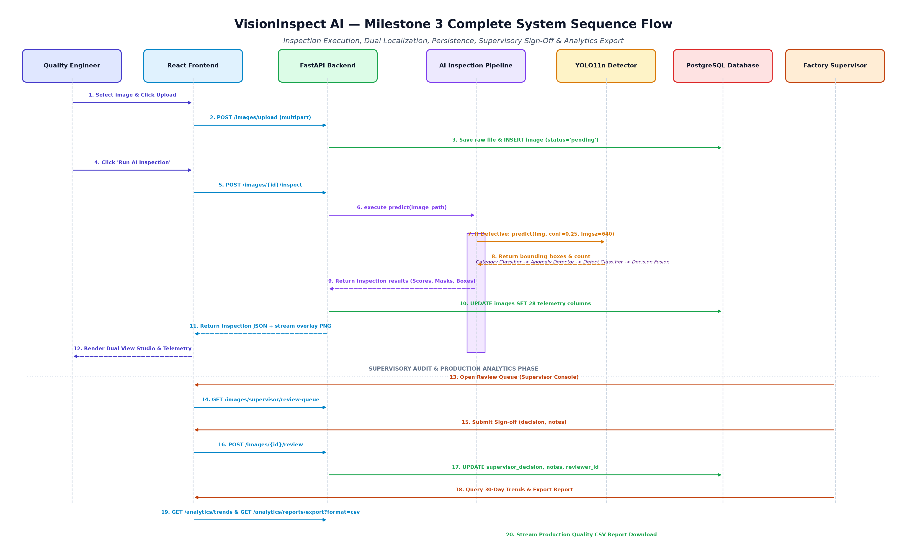

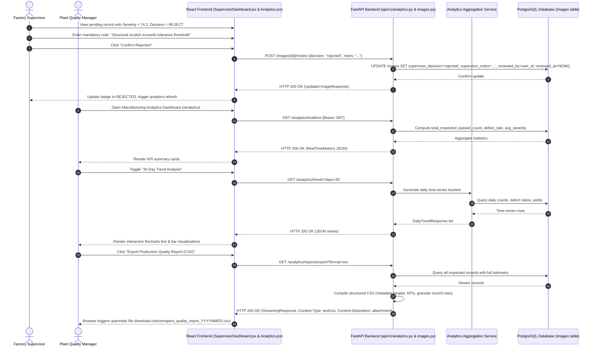
```mermaid
sequenceDiagram
    autonumber
    actor FS as Factory Supervisor
    actor QM as Plant Quality Manager
    participant UI as React Frontend (SupervisorDashboard.jsx & Analytics.jsx)
    participant API as FastAPI Backend (api/v1/analytics.py & images.py)
    participant Engine as Analytics Aggregation Service
    participant DB as PostgreSQL Database (images table)

    %% Supervisory Sign-off Flow
    FS->>UI: View pending record with Severity = 74.2, Decision = REJECT
    FS->>UI: Enter mandatory note: "Structural scratch exceeds tolerance threshold"
    FS->>UI: Click "Confirm Rejection"
    UI->>API: POST /images/{id}/review {decision: "rejected", notes: "..."}
    API->>DB: UPDATE images SET supervisor_decision='rejected', supervisor_notes='...', reviewed_by=user_id, reviewed_at=NOW()
    DB-->>API: Confirm update
    API-->>UI: HTTP 200 OK (Updated ImageResponse)
    UI-->>FS: Update badge to REJECTED, trigger analytics refresh

    %% Real-Time Telemetry & Trends Flow
    QM->>UI: Open Manufacturing Analytics Dashboard (/analytics)
    UI->>API: GET /analytics/realtime [Bearer JWT]
    API->>DB: Compute total_inspected, passed_count, defect_rate, avg_severity
    DB-->>API: Aggregate statistics
    API-->>UI: HTTP 200 OK (RealTimeMetrics JSON)
    UI-->>QM: Render KPI summary cards

    QM->>UI: Toggle "30-Day Trend Analysis"
    UI->>API: GET /analytics/trends?days=30
    API->>Engine: Generate daily time-series buckets
    Engine->>DB: Query daily counts, defect ratios, yields
    DB-->>Engine: Time-series rows
    Engine-->>API: DailyTrendResponse list
    API-->>UI: HTTP 200 OK (JSON series)
    UI-->>QM: Render interactive Recharts line & bar visualizations

    %% Report Export Flow
    QM->>UI: Click "Export Production Quality Report (CSV)"
    UI->>API: GET /analytics/reports/export?format=csv
    API->>DB: Query all inspected records with full telemetry
    DB-->>API: Stream records
    API->>API: Compile structured CSV (metadata header, KPIs, granular record rows)
    API-->>UI: HTTP 200 OK (StreamingResponse, Content-Type: text/csv, Content-Disposition: attachment)
    UI-->>QM: Browser triggers automatic file download (visioninspect_quality_report_YYYYMMDD.csv)
```

---

### 3.4 System Architecture Diagram — Enterprise Quality Platform (Milestone 3)

The Milestone 3 System Architecture Diagram models the end-to-end enterprise platform encompassing all layers, services, models, and stores.

  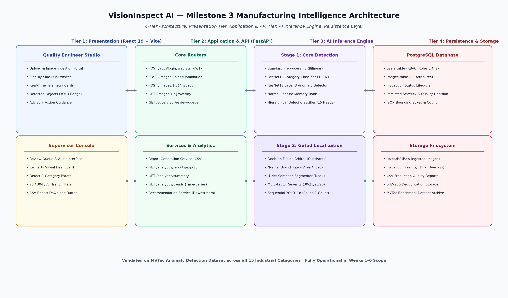

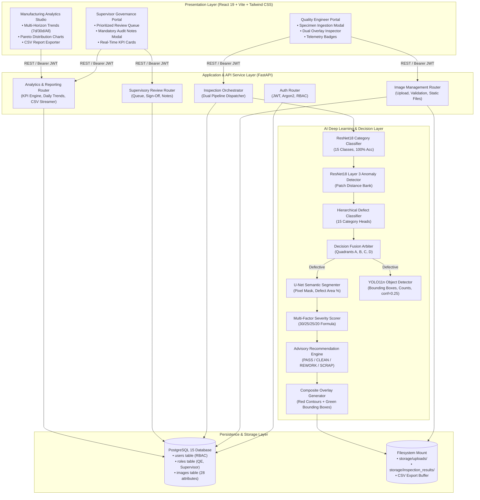
```mermaid
flowchart TD
    subgraph PresentationLayer ["Presentation Layer (React 19 + Vite + Tailwind CSS)"]
        direction TB
        UI_QE["Quality Engineer Portal<br/>• Specimen Ingestion Modal<br/>• Dual Overlay Inspector<br/>• Telemetry Badges"]
        UI_FS["Supervisor Governance Portal<br/>• Prioritized Review Queue<br/>• Mandatory Audit Notes Modal<br/>• Real-Time KPI Cards"]
        UI_QM["Manufacturing Analytics Studio<br/>• Multi-Horizon Trends (7d/30d/All)<br/>• Pareto Distribution Charts<br/>• CSV Report Exporter"]
    end

    subgraph APILayer ["Application & API Service Layer (FastAPI)"]
        direction TB
        AuthR["Auth Router<br/>(JWT, Argon2, RBAC)"]
        ImageR["Image Management Router<br/>(Upload, Validation, Static Files)"]
        InspectR["Inspection Orchestrator<br/>(Dual Pipeline Dispatcher)"]
        ReviewR["Supervisory Review Router<br/>(Queue, Sign-Off, Notes)"]
        AnalyticsR["Analytics & Reporting Router<br/>(KPI Engine, Daily Trends, CSV Streamer)"]
    end

    subgraph AIEngineLayer ["AI Deep Learning & Decision Layer"]
        direction TB
        CatM["ResNet18 Category Classifier<br/>(15 Classes, 100% Acc)"]
        AnomM["ResNet18 Layer 3 Anomaly Detector<br/>(Patch Distance Bank)"]
        DefM["Hierarchical Defect Classifier<br/>(15 Category Heads)"]
        FusionM["Decision Fusion Arbiter<br/>(Quadrants A, B, C, D)"]
        UNetM["U-Net Semantic Segmenter<br/>(Pixel Mask, Defect Area %)"]
        YOLOM["YOLO11n Object Detector<br/>(Bounding Boxes, Counts, conf=0.25)"]
        SevEng["Multi-Factor Severity Scorer<br/>(30/25/25/20 Formula)"]
        RecEng["Advisory Recommendation Engine<br/>(PASS / CLEAN / REWORK / SCRAP)"]
        OverlayEng["Composite Overlay Generator<br/>(Red Contours + Green Bounding Boxes)"]
    end

    subgraph PersistenceLayer ["Persistence & Storage Layer"]
        direction TB
        PostgresDB[("PostgreSQL 15 Database<br/>• users table (RBAC)<br/>• roles table (QE, Supervisor)<br/>• images table (28 attributes)")]
        FileStorage[("Filesystem Mount<br/>• storage/uploads/<br/>• storage/inspection_results/<br/>• CSV Export Buffer")]
    end

    %% Client to API
    UI_QE -->|REST / Bearer JWT| ImageR
    UI_QE -->|REST / Bearer JWT| InspectR
    UI_FS -->|REST / Bearer JWT| ReviewR
    UI_FS -->|REST / Bearer JWT| AnalyticsR
    UI_QM -->|REST / Bearer JWT| AnalyticsR

    %% API to AI Engine
    InspectR --> CatM
    CatM --> AnomM
    AnomM --> DefM
    DefM --> FusionM
    FusionM -->|Defective| UNetM
    FusionM -->|Defective| YOLOM
    UNetM --> SevEng
    SevEng --> RecEng
    RecEng --> OverlayEng

    %% Connections to Persistence
    AuthR --> PostgresDB
    ImageR --> PostgresDB
    ImageR --> FileStorage
    InspectR --> PostgresDB
    ReviewR --> PostgresDB
    AnalyticsR --> PostgresDB
    OverlayEng --> FileStorage
```

---

# Part 4: Cross-Milestone Traceability & Implementation Matrix

The following matrix cross-references every UML diagram against the repository codebase, confirming that every modeled architecture component corresponds to implemented, production-verified code.

| Milestone | Diagram Type | File Location | Primary Implementation Files | Verified Features / Functionality |
| :--- | :--- | :--- | :--- | :--- |
| **M1** | Use Case Diagram | `images/milestone1/use_case_diagram.png` | `backend/app/api/v1/auth.py`, `backend/app/api/v1/images.py` | Quality Engineer vs Supervisor RBAC, image ingestion, metadata retrieval |
| **M1** | Activity Diagram | `images/milestone1/activity_diagram.png` | `backend/app/api/v1/images.py`, `backend/app/core/security.py` | Validation (5MB, MIME, SHA-256), disk write, DB insertion, review sign-off |
| **M1** | Sequence (Upload) | `images/milestone1/sequence_diagram_upload.png` | `frontend/src/components/UploadModal.jsx`, `backend/app/api/v1/images.py` | Multipart form ingestion, disk persistence, DB record creation |
| **M1** | Sequence (Review) | `images/milestone1/sequence_diagram_review.png` | `frontend/src/pages/SupervisorDashboard.jsx`, `backend/app/api/v1/images.py` | Review queue fetch, supervisor sign-off, mandatory audit notes |
| **M1** | Class Diagram | `images/milestone1/class_diagram.png` | `backend/app/models/`, `backend/app/schemas/` | SQLAlchemy ORM models (`User`, `Role`, `ImageRecord`), Pydantic schemas |
| **M1** | Database ERD | `images/milestone1/database_diagram.png` | `backend/app/models/user.py`, `backend/app/models/image.py` | Relational foreign keys (`roles` -> `users` -> `images`), indices, constraints |
| **M1** | State Machine | `images/milestone1/state_machine_diagram.png` | `backend/app/models/image.py` | Lifecycle states (`pending` -> `inspected` -> `approved`/`rejected`) |
| **M1** | System Architecture | `images/milestone1/architecture_diagram.png` | Complete repository structure (Milestone 1) | 3-tier decoupled web architecture (React 19 + FastAPI + PostgreSQL) |
| **M1** | Deployment Diagram | `images/milestone1/deployment_diagram.png` | `docker-compose.yml`, `backend/run.py` | Client browser, Uvicorn ASGI port 8000, PostgreSQL port 5432, local storage |
| **M2** | Use Case Diagram | `images/milestone2/use_case_diagram.jpg` | `ai/pipeline.py`, `backend/app/api/v1/images.py` | Automated multi-model inspection trigger, dual overlay retrieval |
| **M2** | Activity Diagram | `images/milestone2/activity_diagram.jpg` | `ai/decision_fusion.py`, `ai/pipeline.py` | Decision Fusion (Quad A/B/C/D), gated U-Net segmentation & YOLO11n |
| **M2** | Sequence Diagram | `images/milestone2/sequence_diagram.jpg` | `ai/pipeline.py`, `backend/app/api/v1/images.py` | Synchronous AI orchestration, composite overlay rendering, DB persistence |
| **M2** | System Architecture | `images/milestone2/architecture_diagram.jpg` | `ai/models/`, `ai/pipeline.py`, `backend/` | ResNet18 classifier, Layer 3 anomaly detector, U-Net, YOLO11n baseline |
| **M3** | Use Case Diagram | `images/milestone3/use_case_diagram.png` | `backend/app/api/v1/analytics.py`, `frontend/src/pages/Analytics.jsx` | Severity scoring, advisory recommendation, trend analysis, CSV report export |
| **M3** | Activity Diagram | `images/milestone3/activity_diagram.png` | `ai/severity.py`, `backend/app/api/v1/analytics.py` | 4-factor severity formula, Accept/Reject decision, Pass/Clean/Rework/Scrap |
| **M3** | Sequence Diagram | `images/milestone3/sequence_diagram.png` | `backend/app/api/v1/analytics.py`, `frontend/src/pages/SupervisorDashboard.jsx` | Review sign-off, real-time KPI fetch, 30-day daily trends, streaming CSV download |
| **M3** | System Architecture | `images/milestone3/architecture_diagram.png` | Complete repository structure (Milestones 1 – 3) | Enterprise architecture with supervisory governance, analytics engine, 28 DB fields |

---

## Architectural Summary & Design Principles

1. **Strict Separation of Concerns**:
   The presentation layer (React 19) interacts with backend logic exclusively through documented RESTful JSON APIs and token authentication. Neither the database nor the deep learning weights are directly accessible from the client.
2. **Gated Inference for Computational Efficiency**:
   High-overhead pixel segmentation (U-Net) and bounding-box inference (YOLO11n) execute strictly when Decision Fusion confirms a defect. For nominal manufacturing samples (Quadrants A and D), heavy models are bypassed, preserving high FPS throughput and eliminating false-positive bounding boxes.
3. **Dual Defect Localization**:
   By uniting semantic contour segmentation (U-Net) and discrete bounding-box object detection (YOLO11n), VisionInspect AI provides plant operators with both continuous physical damage quantification (area percentage) and discrete defect object counts.
4. **Transparent Multi-Factor Severity Scoring**:
   Rather than treating quality classification as a black box, severity is computed as an explainable weighted linear combination of physical size (30%), geometric location (25%), defect hazard (25%), and model confidence (20%).
5. **Legally Binding Supervisory Sign-Off**:
   Every inspection record accommodates human-in-the-loop oversight. Plant supervisors can review AI telemetry, examine overlays, enter mandatory rationale notes, and stamp official approval or rejection into immutable audit logs.
6. **Manufacturing Intelligence & Compliance Export**:
   All 28 inspection attributes feed real-time KPI metrics and multi-horizon trend aggregations, exportable via standardized CSV reports for enterprise resource planning (ERP) integration.
