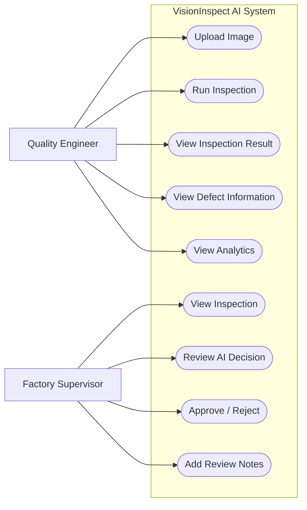
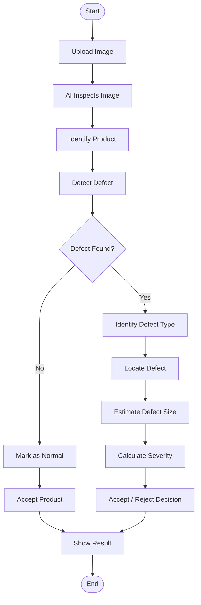
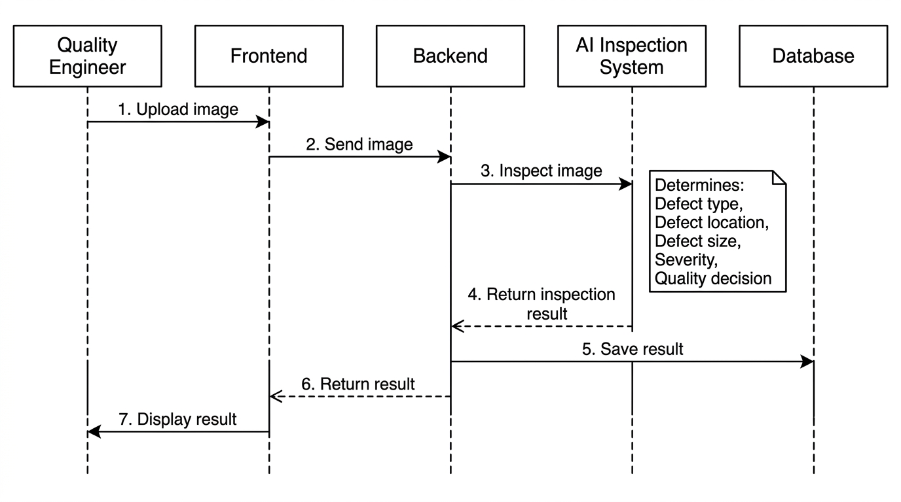
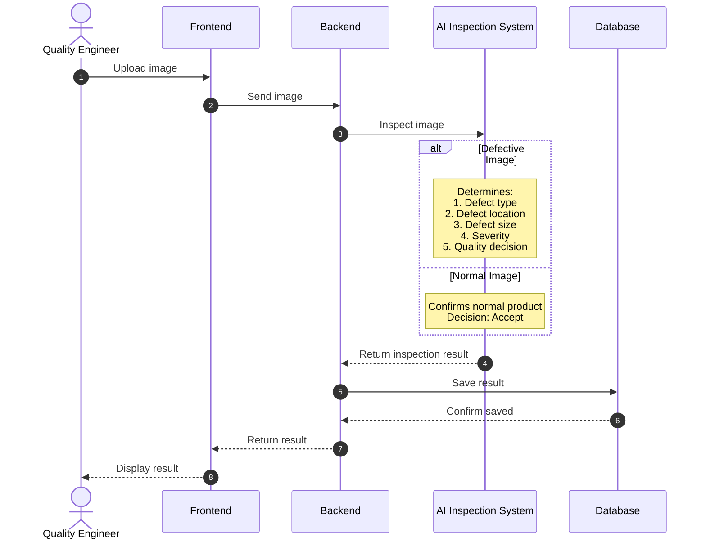
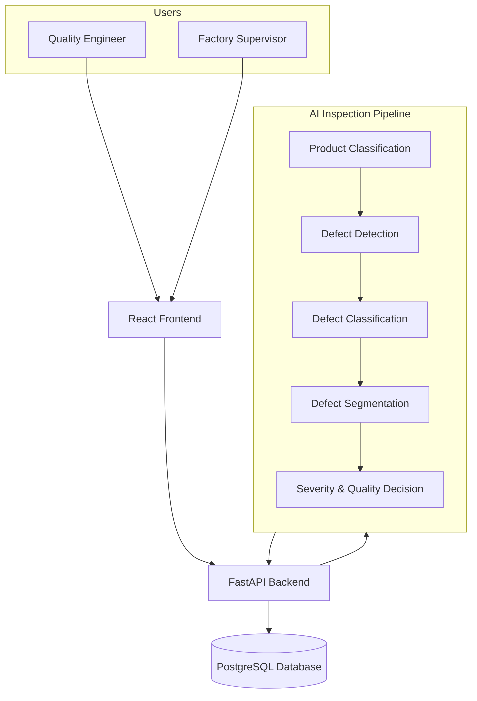

# VisionInspect AI — Milestone 2 UML Diagrams

This document contains the minimal, clean, non-technical UML diagrams for Milestone 2 of VisionInspect AI.

---

## 1. Use Case Diagram

**Explanation:**  
The Quality Engineer uploads product photos, runs automated inspections, and checks defect details and overall quality trends. The Factory Supervisor audits completed inspections, reviews the AI's recommendations, signs off with an official approval or rejection, and attaches review notes.

---

## 2. Activity Diagram — AI Inspection

  

**Explanation:**  
When an image is submitted, the system automatically recognizes the product and scans for flaws. If the part is defect-free, it is accepted as normal; if a defect is found, the system identifies its type, pinpoint location, physical size, and severity level before making a final accept-or-reject recommendation.

---

## 3. Sequence Diagram — Inspection Flow

**Explanation:**  
The Quality Engineer submits an image through the web dashboard, which forwards it to the server and AI engine for analysis. Once the AI finishes examining the image and measuring any defects, the server stores the results in the database and sends them back to be displayed on screen.

---

## 4. High-Level System Architecture Diagram

**Explanation:**  
Factory personnel interact with the system via a React web application connected to a FastAPI backend service. The backend sends incoming images through a 5-step AI pipeline to recognize the product and detect defects, saving all inspection records into a PostgreSQL database.
